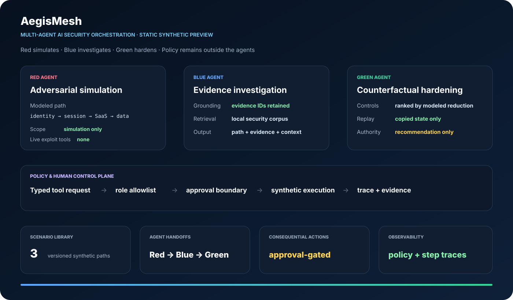
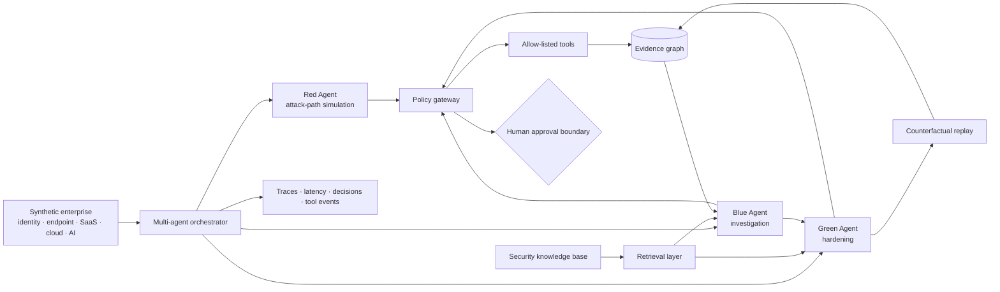

<div align="center">

# AegisMesh

### Multi-Agent AI Security Orchestration for Adversarial Simulation, Investigation & Hardening

**A defensive AI-native cybersecurity platform that coordinates specialized Red, Blue, and Green agents over a shared evidence graph—with policy-gated tools, retrieval-grounded reasoning, counterfactual hardening, and human-controlled decisions.**

[](https://github.com/VinayK88/AegisMesh/actions/workflows/ci.yml)
[](https://www.python.org/)
[](https://fastapi.tiangolo.com/)
[](#multi-agent-security-model)
[](#safety-boundary)
[](#evaluation-boundary)

**Red Agent · Blue Agent · Green Agent · Orchestration · RAG · Evidence Graph · Policy Gateway · Counterfactual Security · Observability**

[Platform](#platform-overview) · [Agents](#multi-agent-security-model) · [Architecture](#architecture) · [Safety](#safety-architecture) · [Evaluation](#evaluation-model) · [API](#api) · [Quick Start](#quick-start)

</div>

---



> **Core question:** Can specialized security agents safely collaborate to simulate a threat, investigate the resulting evidence, recommend the smallest effective defensive change, and prove the impact through replay—without giving autonomous agents unrestricted control of real systems?

## Platform overview

AegisMesh models an end-to-end AI-native security workflow rather than a single chatbot or classifier.

A synthetic enterprise environment is shared by three specialized agents:

- the **Red Agent** performs bounded, simulation-only adversarial planning;
- the **Blue Agent** reconstructs activity from evidence, retrieves relevant security context, and builds an explainable investigation;
- the **Green Agent** recommends defensive controls and replays the scenario to measure counterfactual improvement.

A central orchestrator coordinates those agents while keeping tool authorization, evidence provenance, human approval, and system telemetry outside the agents themselves.

```text
Synthetic enterprise state
          │
          ▼
  ┌─────────────────┐
  │  Orchestrator   │
  └────────┬────────┘
           │
     ┌─────┼─────┐
     ▼     ▼     ▼
   RED    BLUE  GREEN
   agent  agent  agent
     │     │     │
     └─────┼─────┘
           ▼
   Shared evidence graph
           │
           ▼
 Policy + approval gateway
           │
           ▼
 Counterfactual replay
```

The design intentionally separates **agent reasoning** from **security authority**. Agents may propose; independent controls decide what is permitted.

## Multi-agent security model

### Red Agent — adversarial simulation

The Red Agent asks:

> **Which plausible attack path should the defender test next?**

It operates only on synthetic graph state and approved simulation tools. It can:

- identify modeled identity, endpoint, SaaS, cloud, and AI-agent attack paths;
- select a bounded test path from the synthetic environment;
- associate simulated behaviors with ATT&CK-style tactics and techniques;
- generate synthetic security events for downstream investigation;
- expose the assumptions behind the chosen path.

It cannot exploit hosts, execute malware, scan networks, steal credentials, or interact with live targets.

### Blue Agent — investigation & evidence reasoning

The Blue Agent asks:

> **What happened, what evidence supports that conclusion, and what remains uncertain?**

It can:

- correlate identity, endpoint, SaaS, cloud, and agent telemetry;
- retrieve relevant security knowledge from the local evidence corpus;
- reconstruct the simulated attack path;
- maintain supporting and contradictory evidence;
- map observations to ATT&CK-style context;
- produce an evidence-grounded investigation summary;
- recommend—not execute—containment actions.

### Green Agent — security posture hardening

The Green Agent asks:

> **What is the smallest defensive change that most weakens the modeled path?**

It can:

- inspect the attack path and current controls;
- propose least-privilege, identity, token, logging, segmentation, or application-control improvements;
- rank candidate controls by modeled reduction;
- replay the scenario after each proposed change;
- compare original and residual path risk.

The resulting reduction is a **synthetic counterfactual measurement**, not a production breach probability.

## Architecture



### System layers

| Layer | Responsibility |
| --- | --- |
| Synthetic environment | Versioned enterprise graph, controls, telemetry, and scenarios |
| Agent layer | Specialized Red, Blue, and Green reasoning workflows |
| Orchestrator | State transitions, agent handoffs, retries, and workflow lifecycle |
| Retrieval | Evidence-grounded local security knowledge retrieval |
| Evidence graph | Shared entities, observations, paths, controls, and provenance |
| Policy gateway | Tool allowlists, role restrictions, and approval requirements |
| Counterfactual engine | Re-score and replay after proposed defensive changes |
| Observability | Agent steps, tool calls, timing, decisions, and failure context |
| API / UI | Analyst-facing report and workflow inspection |

## AI & model integration

AegisMesh treats the model as a replaceable component of a larger security system.

The model-routing interface is designed around task characteristics such as:

```text
structured extraction  → low-cost model class
retrieval               → embedding / retrieval component
security investigation  → reasoning model class
summarization           → compact generation model class
high-impact proposal    → reasoning + approval requirement
```

The public repository does **not** claim results from external proprietary models that were not actually run. The checked-in implementation uses deterministic reference agents so orchestration, safety, retrieval, evidence, and evaluation can be tested offline.

Production adapters can connect version-pinned models behind the same contracts and measure task success, groundedness, latency, token usage, cost, tool-selection quality, unsupported claims, and human-escalation rates.

## Retrieval-grounded security reasoning

The Blue and Green agents retrieve from a small local security corpus containing defensive concepts, technique context, and control guidance.

```text
Agent question
     ↓
query normalization
     ↓
local evidence retrieval
     ↓
ranked security context
     ↓
agent reasoning
     ↓
cited evidence IDs
```

The current implementation stays dependency-light and deterministic. A production deployment could replace this layer with enterprise search, vector embeddings, hybrid lexical/vector retrieval, tenant-specific threat intelligence, incident history, and access-controlled security knowledge.

## Evidence graph

All agents work over a common evidence model rather than exchanging free-form conclusions.

Representative entities include:

```text
user
identity session
device
application
OAuth grant
cloud workload
AI agent
resource
control
security event
technique
```

The graph preserves the distinction between:

- observed synthetic evidence;
- modeled relationships;
- agent hypotheses;
- recommended controls;
- replay results.

That separation prevents a model-generated hypothesis from silently becoming a fact.

## Safety architecture

AegisMesh uses **policy outside the model**.

```text
Agent proposal
     ↓
Typed tool request
     ↓
Role + tool policy
     ↓
Approval requirement
     ↓
Allowed synthetic execution
     ↓
Immutable evidence / trace
```

Key design principles:

- **Red is simulation-only.** No live exploitation, scanning, malware, credential access, or persistence.
- **Tools are allow-listed.** Agents cannot invoke arbitrary shell, network, or cloud actions.
- **High-impact actions require human approval.** The public lab records recommendations but does not execute consequential changes.
- **Evidence is typed and attributable.** Conclusions point back to evidence IDs and graph paths.
- **Agent output is untrusted.** Authorization and validation remain deterministic.
- **Replay is isolated.** Counterfactual changes modify a copied synthetic environment, never the source environment.

## Evaluation model

AegisMesh evaluates the **workflow**, not just the quality of one generated answer.

The executable synthetic baseline measures dimensions such as:

| Dimension | What is evaluated |
| --- | --- |
| Simulation validity | Red Agent stays inside approved synthetic paths and tools |
| Investigation coverage | Blue Agent identifies evidence supporting the simulated path |
| Grounding | Investigation claims retain evidence references |
| Hardening validity | Green Agent proposes controls that apply to the modeled path |
| Counterfactual improvement | Replay produces lower modeled path risk when an effective control is applied |
| Safety | Unauthorized or high-impact actions do not bypass policy |
| Workflow completion | Required agent handoffs complete successfully |
| Observability | Agent/tool decisions remain traceable |

Runtime reports expose the actual values generated from the checked-in fixtures. This README intentionally avoids presenting those synthetic regression values as production efficacy.

## Example workflow

```text
1. RED
   Selects a modeled path:
   user → session → SaaS app → sensitive resource

2. SIMULATION
   Generates synthetic identity, token, and resource-access events

3. BLUE
   Correlates the events
   Retrieves defensive context
   Reconstructs the evidence path
   Produces an investigation with cited evidence

4. GREEN
   Evaluates candidate controls
   Proposes token protection / scope reduction / stronger authentication

5. REPLAY
   Copies the synthetic environment
   Applies the selected control
   Re-scores the path

6. REVIEW
   Original state vs hardened state
   Evidence, assumptions, and agent traces remain inspectable
```

## API

The FastAPI service exposes the workflow without granting agents unrestricted execution authority.

```text
GET  /healthz
GET  /scenarios
GET  /report
POST /simulate/{scenario_id}
GET  /traces/{run_id}
GET  /docs
```

## Dashboard

The browser dashboard is designed around four operational views:

```text
┌ RED AGENT ─────────────┐  ┌ BLUE AGENT ────────────┐
│ simulated path         │  │ evidence & hypotheses  │
│ modeled techniques     │  │ investigation status  │
│ assumptions            │  │ grounding             │
└────────────────────────┘  └────────────────────────┘

┌ GREEN AGENT ───────────┐  ┌ SYSTEM / SAFETY ───────┐
│ proposed controls      │  │ policy decisions       │
│ counterfactual replay  │  │ tool events            │
│ residual risk          │  │ workflow timing        │
└────────────────────────┘  └────────────────────────┘
```

The checked-in SVG is a static preview of the intended analyst experience. It is not a screenshot of a production Microsoft or customer system.

## Quick Start

```bash
git clone https://github.com/VinayK88/AegisMesh.git
cd AegisMesh

python -m venv .venv
source .venv/bin/activate
pip install -e '.[api]'

# Run the synthetic multi-agent workflow
aegismesh

# Run tests
python -m unittest discover -s tests -v

# Start API / dashboard
uvicorn aegismesh.api:app --reload
```

Docker:

```bash
docker build -t aegismesh .
docker run --rm -p 8000:8000 aegismesh
```

## Repository map

```text
aegismesh/
├── agents.py          Red / Blue / Green agent workflows
├── orchestrator.py    multi-agent state machine
├── environment.py     synthetic enterprise and replay state
├── evidence.py        evidence graph and provenance
├── retrieval.py       local retrieval / RAG layer
├── policy.py          tool policy and approval boundary
├── model_router.py    pluggable model-task routing contract
├── observability.py   run / step / tool traces
├── report.py          evaluation and synthetic baseline
└── api.py             FastAPI + analyst dashboard

data/                  synthetic scenarios and security knowledge
docs/                  architecture, threat model, evaluation methodology
tests/                 workflow, safety, replay, retrieval, and API tests
assets/                dashboard preview
```

## Production evolution

A production-grade implementation would add:

- authenticated, least-privileged enterprise security connectors;
- durable workflow state and distributed queues;
- hybrid vector + lexical retrieval with tenant isolation;
- versioned model adapters and model-quality routing;
- OpenTelemetry traces, SLOs, cost budgets, and failure dashboards;
- checkpointing, retries, idempotency, and replay-safe tool execution;
- human approval workflows for consequential actions;
- model and retrieval evaluation with temporal holdouts;
- prompt-injection resistance and tool-definition integrity monitoring;
- analyst feedback loops and calibrated escalation thresholds;
- red/blue/green scenario libraries with explicit authorization boundaries.

## Evaluation boundary

Everything checked into this repository is **synthetic, deterministic, and defensive**.

AegisMesh does not establish real-world penetration-testing success, SOC detection recall, model safety, control effectiveness, or breach-risk reduction. Counterfactual risk values describe the internal synthetic graph only.

No live credentials, customer telemetry, production tenants, autonomous containment, exploit execution, malware, persistence, or destructive actions are included.

## Safety boundary

This repository is intended for defensive security engineering, AI-system design, evaluation research, and explicitly authorized simulation. It must not be used to target systems without authorization.

---

<div align="center">

### **Agents propose. Evidence grounds. Policy authorizes. Humans remain in control.**

</div>
