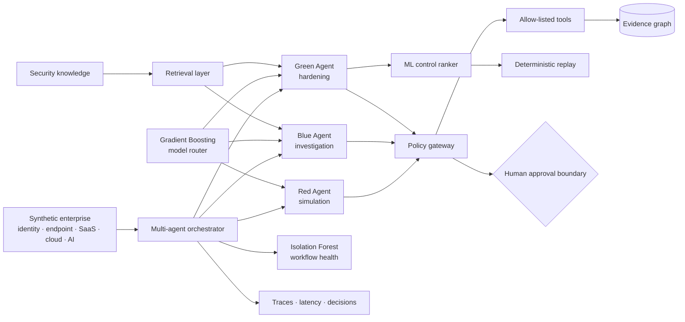

<div align="center">

# AegisMesh

### Multi-Agent AI Security Orchestration for Adversarial Simulation, Investigation & Hardening

**A defensive AI-native cybersecurity platform coordinating specialized Red, Blue, and Green agents over a shared evidence graph—with retrieval-grounded reasoning, learned model routing, ML-assisted hardening, workflow anomaly monitoring, policy-gated tools, and human-controlled decisions.**

[](https://github.com/VinayK88/AegisMesh/actions/workflows/ci.yml)
[](https://www.python.org/)
[](https://fastapi.tiangolo.com/)
[](#security-ml-layer)
[](#safety-architecture)
[](#evaluation-boundary)

**Red Agent · Blue Agent · Green Agent · RAG · Evidence Graph · Security ML · Policy Gateway · Counterfactual Security · Observability**

[Overview](#platform-overview) · [Dashboard](#dashboard-preview) · [Sample I/O](#sample-input--output) · [Security ML](#security-ml-layer) · [Agents](#multi-agent-security-model) · [Architecture](#architecture) · [Safety](#safety-architecture) · [Evaluation](#evaluation-model) · [Quick Start](#quick-start)

</div>

---

## Dashboard preview

<p align="center">
  
</p>

> **Static synthetic preview.** The dashboard represents the runnable lab's Red Agent simulation, Blue Agent investigation, Green Agent hardening, policy decisions, evidence graph, workflow health, and observability. It is not a screenshot of a Microsoft, customer, or production environment.

> **Core question:** Can specialized security agents safely collaborate to simulate a threat, investigate the evidence, recommend the smallest effective defensive change, and verify the impact through replay—without giving autonomous agents unrestricted control of real systems?

## Platform overview

AegisMesh models an end-to-end AI-native security workflow rather than a single chatbot or classifier.

A synthetic enterprise environment is shared by three specialized agents:

- **Red Agent** performs bounded, simulation-only adversarial planning and emits synthetic telemetry.
- **Blue Agent** reconstructs activity from evidence, retrieves security context, and produces a grounded investigation.
- **Green Agent** uses ML to prioritize defensive controls and verifies the selected recommendation with deterministic counterfactual replay.

The orchestrator adds two platform-level intelligence layers: a **learned model router** for task/model selection and an **Isolation Forest workflow-health monitor** for unusual agent behavior. Tool authorization, approval requirements, and consequential-action boundaries remain deterministic and outside the models.

```text
Synthetic enterprise state
          │
          ▼
  ┌─────────────────────┐
  │ Multi-Agent         │
  │ Orchestrator        │
  └──────────┬──────────┘
             │
      ┌──────┼──────┐
      ▼      ▼      ▼
     RED    BLUE   GREEN
      │      │       │
      │      │    ML control ranking
      │      │       │
      └──────┼───────┘
             ▼
      Shared evidence graph
             │
      Learned model router
             │
      Workflow anomaly ML
             │
             ▼
       Policy + approval
             │
             ▼
    Deterministic replay
```

**Agents propose. ML prioritizes. Evidence grounds. Policy authorizes. Replay verifies. Humans remain in control.**

## Sample input & output

The public lab ships with three versioned synthetic scenarios. A run is started by selecting a scenario ID; the orchestrator loads that synthetic enterprise path and coordinates all three agents.

### Sample input

```http
POST /simulate/oauth-mailbox-abuse
```

```json
{
  "scenario_id": "oauth-mailbox-abuse",
  "name": "OAuth mailbox abuse",
  "objective": "Exercise a synthetic risky-consent path into mailbox data.",
  "techniques": ["T1098.003", "T1114.002"],
  "path": [
    {
      "source": "user",
      "target": "oauth_grant",
      "relation": "consent",
      "risk": 0.58,
      "control": "admin consent workflow"
    },
    {
      "source": "oauth_grant",
      "target": "mailbox",
      "relation": "persistent_api_access",
      "risk": 0.69,
      "control": "scope reduction"
    }
  ],
  "boundary": "synthetic defensive simulation"
}
```

### Sample output

The actual API response contains complete traces, evidence graph data, retrieval results, model-routing metadata, ML control rankings, and workflow-health evidence. This abbreviated example shows the major decision boundaries:

```json
{
  "run_id": "<generated-run-id>",
  "scenario_id": "oauth-mailbox-abuse",
  "original_risk": 0.8698,
  "residual_risk": 0.6814,
  "risk_reduction": 0.1884,
  "red": {
    "status": "complete",
    "simulation_only": true,
    "model_route": {
      "model": "GradientBoostingClassifier",
      "selected_model_class": "compact-model",
      "safety_override": false
    }
  },
  "blue": {
    "status": "complete",
    "verdict": "synthetic_attack_path_reconstructed",
    "evidence_coverage": 1.0,
    "grounded": true,
    "model_route": {
      "model": "GradientBoostingClassifier",
      "selected_model_class": "reasoning-model"
    }
  },
  "green": {
    "status": "complete",
    "model_route": {
      "selected_model_class": "high-reliability-model",
      "safety_override": true
    },
    "ml_control_ranking": {
      "model": "GradientBoostingRegressor",
      "boundary": "ML prioritizes controls; deterministic counterfactual replay verifies impact"
    },
    "selected_control": {
      "control": "scope reduction",
      "verified_residual_risk": 0.6814,
      "verified_risk_reduction": 0.1884
    },
    "counterfactual": {
      "prediction_verified_by_replay": true,
      "source_environment_mutated": false
    }
  },
  "workflow_ml": {
    "model": "IsolationForest",
    "status": "NORMAL",
    "boundary": "workflow-health anomaly score; not a compromise probability"
  }
}
```

The risk values are **internal synthetic graph scores**, not compromise probabilities or claims of real-world control effectiveness.

## Security ML layer

AegisMesh deliberately uses ML for **selection, prioritization, and monitoring**—not authorization.

| ML component | Model | Purpose | Hard boundary |
| --- | --- | --- | --- |
| **Learned model router** | Gradient Boosting Classifier | Select compact, reasoning, or high-reliability model classes from task complexity, evidence, graph depth, risk, latency and cost context | Approval-required and high-impact tasks are deterministically forced to the highest-reliability route |
| **Green control ranker** | Gradient Boosting Regressor | Rank defensive controls by predicted synthetic path-risk reduction | Deterministic counterfactual replay recomputes and verifies the final reduction |
| **Workflow health monitor** | Isolation Forest | Detect unusual orchestration patterns such as excessive retries, denials, errors, repeated steps, or abnormal handoffs | Advisory workflow-health signal only; never authorizes or blocks tools |

### Learned model routing

```text
Task + security context
        │
        ▼
Gradient Boosting router
        │
   ┌────┼─────────┐
   ▼    ▼         ▼
compact reasoning high-reliability
   │    │         │
   └────┼─────────┘
        ▼
Deterministic safety override
        │
        ▼
Selected model class
```

Features include task class, scenario complexity, evidence count, graph depth, modeled risk, latency budget, cost budget, and approval requirement.

### ML-assisted Green Agent

```text
Attack path + candidate controls
              │
              ▼
Gradient Boosting Regressor
              │
              ▼
Predicted control ranking
              │
              ▼
Top candidate
              │
              ▼
Deterministic counterfactual replay
              │
              ▼
Verified residual risk
```

The ML prediction is never reported as the final control effect. The deterministic replay result remains authoritative.

### Agent workflow anomaly detection

```text
Agent / tool trace
      │
      ▼
step + policy + transition features
      │
      ▼
Isolation Forest
      │
      ▼
anomaly percentile + top deviations
      │
      ▼
NORMAL / REVIEW
```

The anomaly percentile is **not a compromise probability**. It measures deviation from a deterministic synthetic normal-workflow reference population.

See [`docs/ml-security.md`](docs/ml-security.md) for model features, evaluation methodology, and governance boundaries.

## Multi-agent security model

### Red Agent — adversarial simulation

The Red Agent asks: **Which plausible attack path should the defender test next?**

It can select modeled identity, endpoint, SaaS, cloud, and AI-agent paths; associate them with ATT&CK-style context; and emit synthetic events. It cannot exploit hosts, execute malware, scan networks, steal credentials, or interact with live targets.

### Blue Agent — investigation & evidence reasoning

The Blue Agent asks: **What happened, what evidence supports the conclusion, and what remains uncertain?**

It correlates telemetry, retrieves local defensive knowledge, reconstructs the path, retains evidence IDs, maps ATT&CK-style context, and produces an evidence-grounded analyst result.

### Green Agent — security posture hardening

The Green Agent asks: **What is the smallest defensive change that most weakens the modeled path?**

It uses the learned control ranker to prioritize candidate controls, then replays the highest-ranked control against a copied synthetic environment and reports the verified residual graph risk. It recommends; it does not autonomously alter production systems.

## Architecture



### System layers

| Layer | Responsibility |
| --- | --- |
| Synthetic environment | Versioned enterprise graph, controls, telemetry, and scenarios |
| Agent layer | Specialized Red, Blue, and Green workflows |
| Learned routing | Context-aware abstract model-class selection with deterministic safety override |
| Retrieval | Evidence-grounded local security knowledge retrieval |
| Evidence graph | Shared entities, observations, paths, controls, and provenance |
| ML control prioritization | Predict which defensive control should be replayed first |
| Counterfactual engine | Deterministically recompute path risk after a proposed control |
| Workflow ML | Surface unusual multi-agent execution patterns |
| Policy gateway | Tool allowlists, role restrictions, and approval requirements |
| Observability | Agent steps, tool calls, latency, decisions, and failure context |
| API / UI | Analyst-facing reports and workflow inspection |

## Retrieval-grounded security reasoning

```text
Agent question
     ↓
query normalization
     ↓
local evidence retrieval
     ↓
ranked security context
     ↓
agent reasoning
     ↓
cited evidence IDs
```

The public implementation remains deterministic and offline. Production adapters could replace the local retrieval component with hybrid vector/lexical retrieval, tenant-specific threat intelligence, prior incidents, and access-controlled enterprise knowledge.

## Evidence graph

All agents work over a common evidence model rather than exchanging free-form conclusions. The graph preserves the distinction between observed synthetic evidence, modeled relationships, agent hypotheses, recommended controls, and replay results. A generated hypothesis therefore cannot silently become an observed fact.

## Safety architecture

AegisMesh keeps **policy outside the model**.

```text
Agent proposal
     ↓
Typed tool request
     ↓
Role + tool policy
     ↓
Approval requirement
     ↓
Allowed synthetic execution
     ↓
Immutable evidence / trace
```

Key principles:

- **Red is simulation-only.** No live exploitation, scanning, malware, credential access, or persistence.
- **Tools are allow-listed.** Agents cannot invoke arbitrary shell, network, or cloud actions.
- **High-impact model routing has a deterministic override.** ML cannot downgrade an approval-required task.
- **Green predictions require deterministic replay.** ML cannot declare a control effective by itself.
- **High-impact actions require human approval.** The lab records recommendations; it does not execute consequential production changes.
- **Evidence is typed and attributable.** Conclusions point back to evidence IDs and graph paths.
- **Replay is isolated.** Counterfactual changes modify copied synthetic state only.

## Evaluation model

AegisMesh evaluates the **workflow and the learned components**, not just one generated answer.

| Dimension | What is evaluated |
| --- | --- |
| Simulation validity | Red stays inside approved synthetic paths and tools |
| Investigation coverage | Blue identifies evidence supporting the path |
| Grounding | Investigation claims retain evidence references |
| Router quality | Gradient Boosting routing is evaluated on a deterministic synthetic holdout |
| Control-ranker quality | Regression MAE/R² are computed on a deterministic synthetic holdout |
| Hardening validity | Replay confirms that the selected control reduces the modeled path score |
| Workflow health | Isolation Forest compares traces with a deterministic normal-workflow reference |
| Safety | ML cannot bypass tool policy, approval requirements, or replay verification |
| Observability | Agent/tool/model decisions remain traceable |

Runtime reports expose the exact checked-in synthetic evaluation values. They validate implementation and regression behavior only and are not production-security efficacy claims.

## Example workflow

```text
1. ROUTE     Learned router recommends task/model class
2. RED       Select bounded simulated path
3. SIMULATE  Generate synthetic security events
4. BLUE      Correlate evidence + retrieve context + reconstruct path
5. RANK      Green ML ranks candidate defensive controls
6. REPLAY    Deterministically verify selected control on copied state
7. MONITOR   Isolation Forest scores workflow health
8. REVIEW    Evidence, ML outputs, policy decisions, and traces remain inspectable
```

## API

```text
GET  /healthz
GET  /scenarios
GET  /report
POST /simulate/{scenario_id}
GET  /traces/{run_id}
GET  /docs
```

## Quick Start

```bash
git clone https://github.com/VinayK88/AegisMesh.git
cd AegisMesh
python -m venv .venv
source .venv/bin/activate
pip install -e '.[api]'

# Run synthetic multi-agent + ML workflow
aegismesh

# Run tests
python -m unittest discover -s tests -v

# Start API / dashboard
uvicorn aegismesh.api:app --reload
```

Docker:

```bash
docker build -t aegismesh .
docker run --rm -p 8000:8000 aegismesh
```

## Repository map

```text
aegismesh/
├── agents.py          Red / Blue / Green workflows
├── orchestrator.py    multi-agent orchestration + workflow ML
├── environment.py     synthetic enterprise and replay state
├── evidence.py        evidence graph and provenance
├── retrieval.py       local retrieval / RAG layer
├── policy.py          tool policy and approval boundary
├── model_router.py    learned model routing interface
├── ml.py              routing, control-ranking, and anomaly models
├── observability.py   run / step / tool traces
├── report.py          workflow + ML evaluation report
└── api.py             FastAPI + analyst dashboard

data/                  synthetic scenarios and security knowledge
docs/                  architecture, threat model, ML methodology
tests/                 workflow, safety, replay, retrieval, ML, and API tests
assets/                dashboard preview
```

## Production evolution

A production-grade implementation would add authenticated least-privileged security connectors, durable workflow state and queues, hybrid vector + lexical retrieval, version-pinned model adapters, online routing feedback, temporal ML validation, drift monitoring, OpenTelemetry traces and SLOs, cost budgets, checkpointing and retries, analyst feedback loops, and expanded explicitly authorized scenario libraries.

## Evaluation boundary

Everything checked into this repository is **synthetic, deterministic, and defensive**.

AegisMesh does not establish real-world penetration-testing success, SOC detection recall, LLM quality, model safety, control effectiveness, or breach-risk reduction. The ML models are trained and evaluated on synthetic data/reference populations, and counterfactual risk values describe the internal synthetic graph only.

No live credentials, customer telemetry, production tenants, autonomous containment, exploit execution, malware, persistence, or destructive actions are included.

## Safety boundary

This repository is intended for defensive security engineering, AI-system design, evaluation research, and explicitly authorized simulation. It must not be used to target systems without authorization.

---

<div align="center">

### **Agents propose · ML prioritizes · Evidence grounds · Policy authorizes · Replay verifies**

</div>
